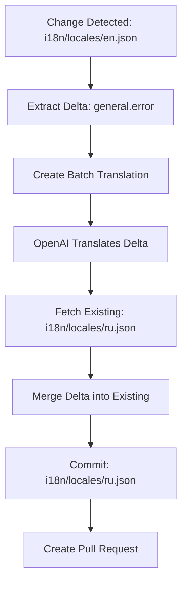

# Delta Workflow Fix - File Path & Merging Issues

## Issue Summary

The delta batch translation workflow was creating files in the wrong locations and not properly merging changes with existing translation files.

### Problems Identified

1. **Wrong File Paths**: 
   - Source file: `i18n/locales/en.json`
   - Was creating: `locales/ar/en.json` ❌
   - Should create: `i18n/locales/ar.json` ✅

2. **No Merging**: Translation deltas were being committed as standalone files instead of being merged with existing translation files in the repository.

3. **Wrong File Names**: Target locale files had the source locale name (`en.json`) instead of the target locale name (`ar.json`, `ru.json`, etc.).

## Root Causes

### 1. Custom ID Parsing Error
**File**: `server/services/translation/deltaBatchOutputProcessor.ts`

**Problem**: Used single underscore as delimiter, but locale codes and filenames contain underscores.

```typescript
// BEFORE (WRONG)
const parts = customId.split('_')
const sessionId = parts[0]
const targetLocale = parts[1]
```

**Solution**: Use double underscore `__` as delimiter.

```typescript
// AFTER (CORRECT)
const parts = customId.split('__')
const sessionId = parts[0]
const targetLocale = parts[1]
const sourceFileNamePart = parts[2]
const sourceFileName = sourceFileNamePart.replace('_delta_json', '.json')
```

### 2. Wrong Path Construction
**File**: `server/services/github/changeWorkflow.ts`

**Problem**: Hard-coded path patterns that didn't respect the original file structure from the repository.

```typescript
// BEFORE (WRONG)
const getTargetPath = (locale: string, type: string, fileName: string): string => {
  if (type === 'global') {
    return `locales/${locale}/${fileName}` // Creates locales/ru/en.json
  }
}
```

**Solution**: Use the original file path from metadata and transform it properly.

```typescript
// AFTER (CORRECT)
const getTargetPath = (locale: string, type: string, fileName: string): string => {
  const originalChange = metadata.changes?.find(c => c.type === type && c.relativePath === fileName)
  
  if (originalChange?.path) {
    const pathParts = originalChange.path.split('/')
    
    if (type === 'global') {
      // Replace en.json with {locale}.json
      const targetFileName = sourceFileName.replace(/^[a-z]{2}\.json$/, `${locale}.json`)
      pathParts[pathParts.length - 1] = targetFileName
      return pathParts.join('/') // Creates i18n/locales/ru.json
    }
  }
}
```

### 3. Missing Delta Merge Logic
**File**: `server/services/github/changeWorkflow.ts`

**Problem**: Translation deltas were committed as complete files, overwriting existing translations.

**Solution**: Fetch existing files from GitHub and merge the delta changes.

```typescript
// Fetch existing file
const existingContent = await client.getFileContent(
  repository.owner,
  repository.name,
  targetPath,
  repository.baseBranch
)

// Parse and merge
const existing = JSON.parse(existingContent)
const delta = JSON.parse(file.content)
const merged = deepMerge(existing, delta)

// Commit merged result
fileChanges.push({
  path: targetPath,
  content: JSON.stringify(merged, null, 2)
})
```

## Files Modified

### 1. `server/services/translation/deltaBatchOutputProcessor.ts`
- Fixed `parseCustomId()` to use `__` delimiter
- Updated to use `sourceFileName` consistently
- Simplified logic to save translation deltas without trying to merge locally

### 2. `server/services/github/changeWorkflow.ts`
- Added `deepMerge()` utility function
- Fixed `getTargetPath()` to use original file paths from metadata
- Added logic to fetch existing files from GitHub and merge deltas
- Proper handling of global JSON files with correct locale-based filenames

## Testing

### Test Case 1: Global File Translation
- **Source**: `i18n/locales/en.json` with key `general.error`
- **Target**: `i18n/locales/ar.json`, `i18n/locales/ru.json`, etc.
- **Expected**: Existing translations preserved, only `general.error` updated

### Test Case 2: Content File Translation
- **Source**: `i18n/en/content/page.md`
- **Target**: `i18n/ar/content/page.md`, `i18n/ru/content/page.md`, etc.
- **Expected**: Complete translated markdown files in correct locale folders

## Example Workflow



## Verification Steps

1. **Check Custom ID Parsing**: Verify `__` delimiter is used
2. **Check File Paths**: Confirm target paths match original repository structure
3. **Check File Names**: Ensure `en.json` becomes `ru.json`, `ar.json`, etc.
4. **Check Merging**: Verify existing translations are preserved
5. **Check Commits**: Review PR to ensure only changed keys are different

## Status

✅ Custom ID parsing fixed
✅ Path construction fixed  
✅ File naming fixed
✅ Delta merging implemented
⏳ Pending testing with next batch completion
